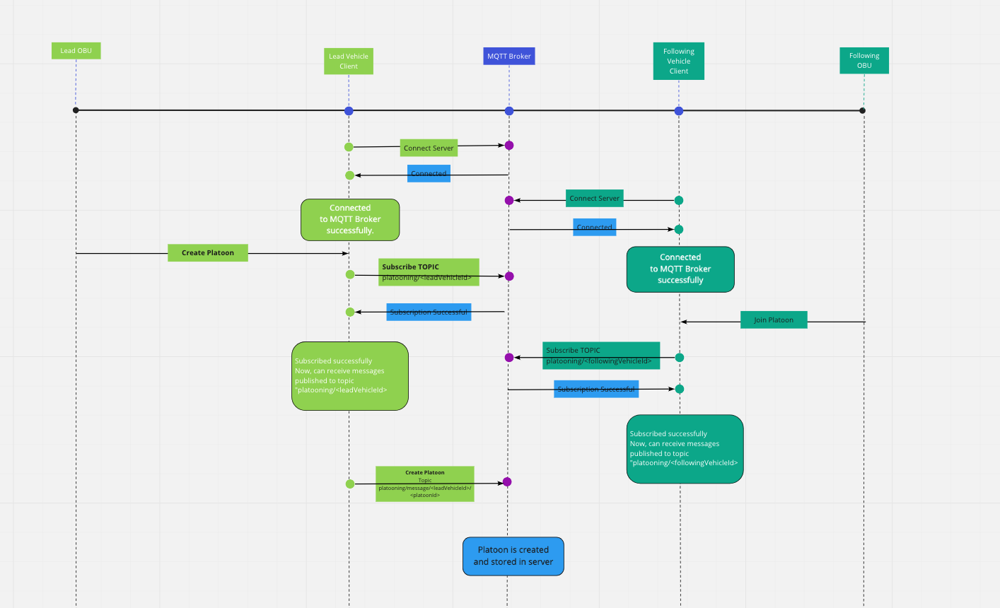
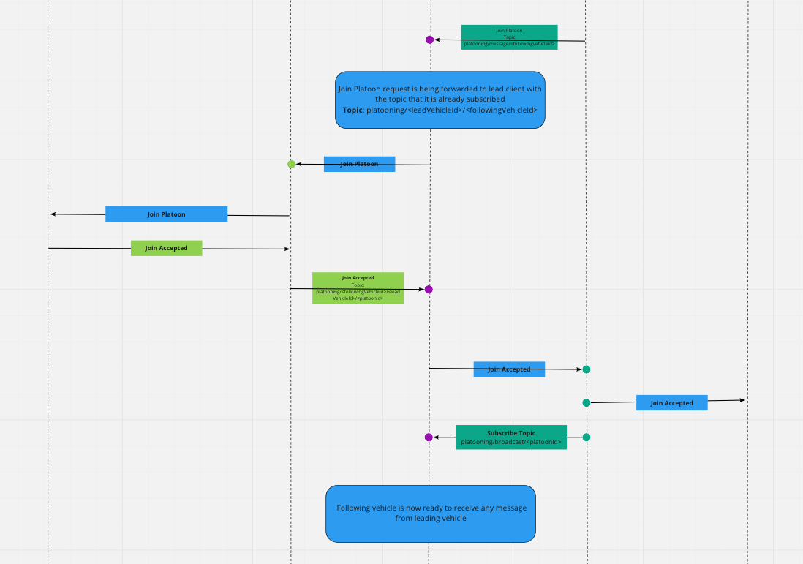
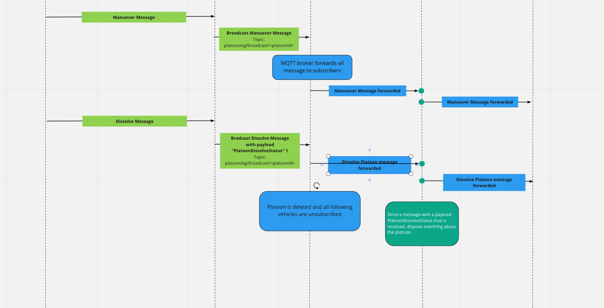

# Start Projects

## Azure Api & Mqtt Broker Server

https://mqtt-broker.azurewebsites.net/

{
"mqttServerIp": "mqttbroker.westeurope.azurecontainer.io",
"mqttUser": "test",
"mqttPassword": "test",
"mqttPort": 1883
}

## Terminal 1 = MqttBroker Server
// Run following commands to initialize the local mqttbroker server

    dotnet restore

    dotnet build

    cd Mqtt.Server

    dotnet run
    
   

## Terminal 2 = Mqtt Lead Vehicle
// With the following commands, lead vehicle connects to the server using basic authentication

    cd Mqtt.LeadClient

    dotnet run

### You will see an ouput like this:

MQTT Server:mqttbroker.westeurope.azurecontainer.io Username:test ClientID:leadVehicle1
Connected successfully with MQTT Brokers.

## Terminal 3 = Mqtt Follower Vehicle

    cd Mqtt.FollowerClient

    dotnet run
 
### You will see an ouput like this:
MQTT Server:mqttbroker.westeurope.azurecontainer.io Username:test ClientID:followingVehicle1
Connected successfully with MQTT Brokers.

## Hierarchy

After the connection has been established, the lead vehicle has to subscribe to your own topic

At Terminal 2, press "S" key to subscribe @$"platooning/{leadvehicleId}/#"

### You will see an ouput like this:

Mqtt.LeadClient git:(master) ✗ Client SubscribeAsync as platooning/leadVehicle1/#

You can see the list of subscribes wehicles with the following url: 

https://mqtt-broker.azurewebsites.net/Service/GetSubscribe

Example List: 
[
{
"id": 5,
"clientId": "leadVehicle1",
"topic": "platooning/leadVehicle1/#",
"qoS": "AtLeastOnce",
"enable": true,
"creationDate": "2021-03-29T03:18:52.627731"
}
]

After that, you can create a new platoon by pressing "P" for Lead Vehicle

### You will see an ouput like this:
Mqtt.LeadClient git:(master) ✗ Client Publish as platooning/message/leadVehicle1/platoon1 payload =>

You can see the list of platoons with the following url: 
https://mqtt-broker.azurewebsites.net/Service/GetPlatoon

Example List:
[
{
"id": 11,
"platoonRealId": "platoon1",
"type": null,
"clientId": "leadVehicle1",
"vechicleId": "leadVehicle1",
"isLead": true,
"isFollower": false,
"enable": true,
"creationDate": "2021-03-29T03:22:43.931418"
}
]

Now lead vehicle can wait for new following vehicles to join the platoon.

The following vehicles have to join their topics for receive direct messages

At terminal 3, press "S" key to subscribe @$"platooning/{followingvehicleId}/#"

### You will see an ouput like this:
Mqtt.FollowerClient git:(master) Client SubscribeAsync as platooning/followingVehicle1/#

To see the subscribers list:
https://mqtt-broker.azurewebsites.net/Service/GetSubscribe

[
{
"id": 5,
"clientId": "leadVehicle1",
"topic": "platooning/leadVehicle1/#",
"qoS": "AtLeastOnce",
"enable": true,
"creationDate": "2021-03-29T03:18:52.627731"
},
{
"id": 6,
"clientId": "followingVehicle1",
"topic": "platooning/followingVehicle1/#",
"qoS": "AtLeastOnce",
"enable": true,
"creationDate": "2021-03-29T03:26:51.706669"
}
]

After that,following vehicle want to join active platoon that Lead vehicle has already created 
Press "s" keyborad button on terminal 3

### You will see an ouput like this:
Mqtt.FollowerClient git:(master) Client Publish joining spesific platoon at the broker as platooning/message/followingVehicle1 payload =>

Topic: platooning/followingVehicle1/leadVehicle1/platoon1. Message Received: {
"Maneuver": 2,
"PlatoonGap": 0,
"PlatoonOverrideStatus": false,
"VehicleRank": 0,
"BreakPedal": 0,
"PlatoonDissolveStatus": false,
"StationId": 0,
"StreamingRequests": 0,
"V2HealthStatus": false,
"TruckRoutingStaus": 0,
"RealPayload": "\u0002\u0000\u0000\u0000\u0000\u0000\u0000\u0000"
}
Client SubscribeAsync as platooning/broadcast/platoon1/#
Topic: platooning/broadcast/platoon1. Message Received: {
"Maneuver": 6,
"PlatoonGap": 242,
"PlatoonOverrideStatus": true,
"VehicleRank": 0,
"BreakPedal": 2,
"PlatoonDissolveStatus": false,
"StationId": 71602726,
"StreamingRequests": 1,
"V2HealthStatus": false,
"TruckRoutingStaus": 0,
"RealPayload": "{\n \"Id\": 0,\n \"Maneuver\": 6,\n \"PlatoonGap\": 0,\n \"PlatoonOverrideStatus\": false,\n \"VehicleRank\": 0,\n \"BreakPedal\": 0,\n \"PlatoonDissolveStatus\": false,\n \"StationId\": 0,\n \"StreamingRequests\": 0,\n \"V2HealthStatus\": false,\n \"TruckRoutingStaus\": 0,\n \"RealPayload\": \"\\u0003\\u0000\\u0000\\u0000\\u0000\\u0000\\u0000\\u0000\"\n}"
}

This information shows us Mqtt Server got a joining message from following vehicle and request accepted by lead vehicle automatically for testing, after accepting lead vehicle send its initial condition to following vehicle via broadcasting channel "platooning/broadcast/platoon1"

You can check all request hierarchies using rest api services

https://mqtt-broker.azurewebsites.net/Service/GetMessage

https://mqtt-broker.azurewebsites.net/Service/GetSubscribe

https://mqtt-broker.azurewebsites.net/Service/GetPlatoon

Finally, at terminal 2, lead vehicle terminal, we can start the broadcasting message for all following vehicles

Press "K" for broadcasting

Client Publish as platooning/broadcast/platoon1 payload =>

### API Services

https://mqtt-broker.azurewebsites.net/Service/Getplatoon

https://mqtt-broker.azurewebsites.net/Service/GetSubscribe

https://mqtt-broker.azurewebsites.net/Service/GetMessage

https://mqtt-broker.azurewebsites.net/Service/GetConnection

mosquitto_sub -h mqttbroker.westeurope.azurecontainer.io -p 1883 -t 'platooning/sdfsdf/#' -i "Device1" -u test -P test -v

mosquitto_pub -h mqttbroker.westeurope.azurecontainer.io -p 1883 -t 'platooning/sdfsdf/sdsd' -i "Device2" -u test -P test -m "asda"

## Flow Diagram

